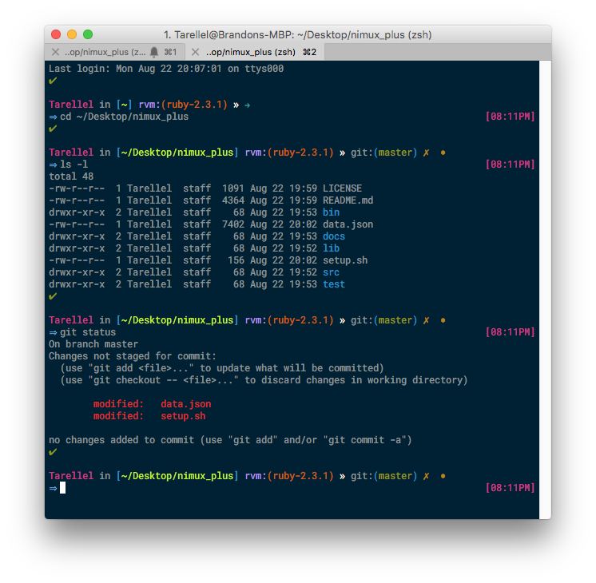

# VUDO-ZSH
Vudo is a vibrant oh-my-zsh theme, that informs you of what ruby version you are
currently using, your current git branch, as well as displaying the current git
status (displayed as colored icons).

### Requirements:
  + Git
  + rvm/rbenv/ruby
  + [oh-my-zsh](https://github.com/robbyrussell/oh-my-zsh)

#### Installation

**Theme**

  One of my favorite color schemes for a terminal and text-editor is [solarized](http://ethanschoonover.com/solarized).

  + Download `Solarized Dark.itermcolors` from [altercation/solarized](https://github.com/altercation/solarized/tree/master/iterm2-colors-solarized).

  + Goto iTerm **Preferences** goto the **Profiles** tab
  + From here you will click on the **colors** tab and in the bottom right, there is a drop down that says `Color Presets` either select `Solarized Dark` or import the theme and apply it as your iterm color theme.
  + The solarized them is right on point with an excellent set of colors.
    The only thing I changed on it was the background color. I changed it to `#001f33` or in RGB: `rgb(0,31,51)`. The dark blue makes the terminal colors pop out a bit more.

**Font/Text Settings**

  I prefer either font they both look great and are pretty similar, except the Fira has more vertical spacing.

  + `12pt Roboto Mono` - [Googles fonts](https://github.com/google/fonts/tree/master/apache/robotomono) are listed on github for download.
  + [x] Draw bold text in bold font
  + [x] Draw bold text in bright colors
  + Mark use thin strokes for anti-aliased text [Always].

    ***Note*** *: with some retina displays you may have to give your font weight in order to make it easier to see.*
  + Set the terminals curser for Box
